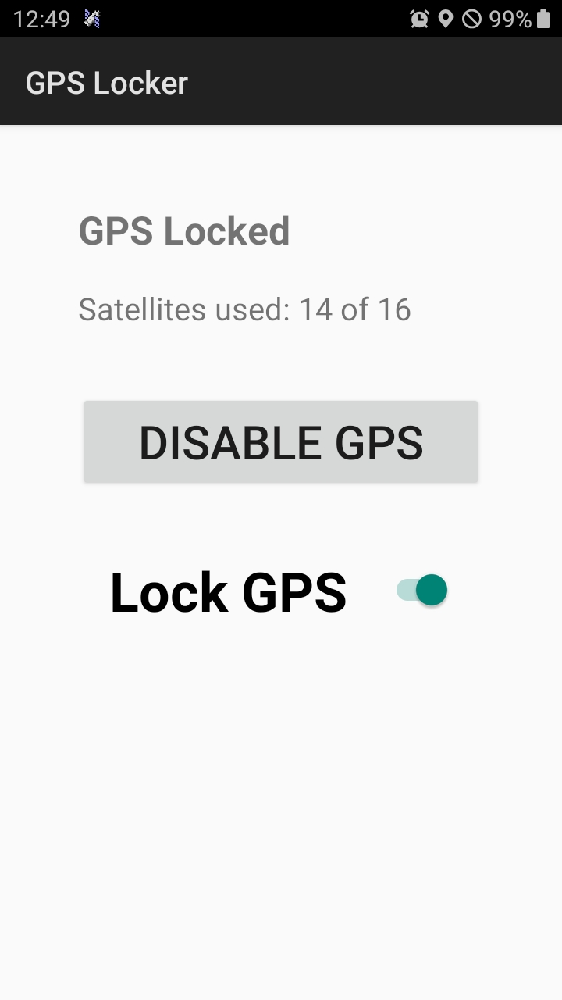

## Overview

GPS Locker is an app for Android that keeps the GPS locked at all times when activated. This allows the GPS to usable at key moments instead of potentially waiting minutes for the GPS to lock. The app was tested with Android 4.4, 9, and 13. The app targets Android 3-13. The app is very light weight and uses no external libraries.

## Download

You can download directly [from Github releases](https://github.com/MrRar/gps_locker/releases).

## License

[Licensed under GPL v2](LICENSE.md)

Some code is from [GPS Logger](https://github.com/mendhak/gpslogger)
